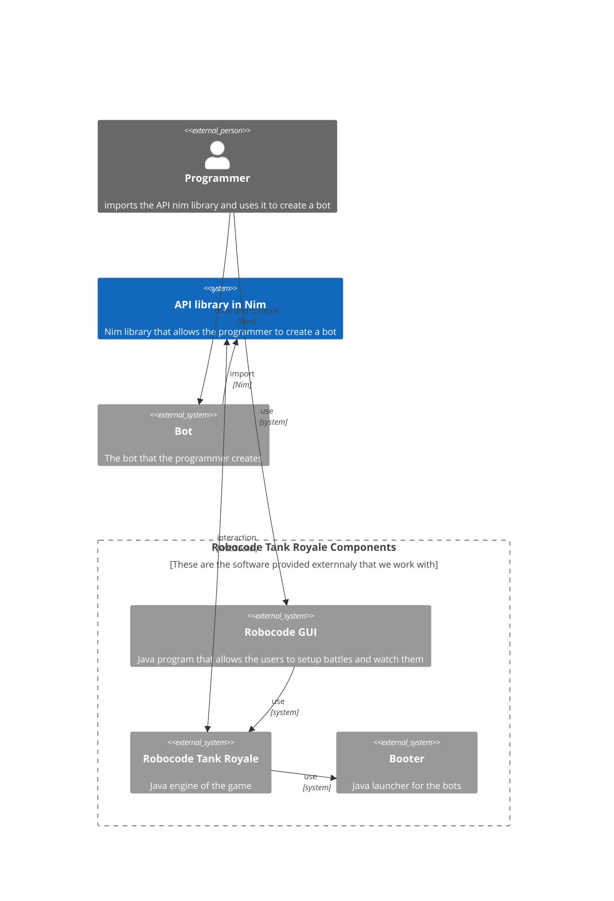

# README for the Robocode Tank Royale API written in Nim version 2

Nim 2.0 is out and brings a lot of iprovements to the language. This is a rewrite of the Robocode Tank Royale API written in Nim to take advantage of the new features of the language.

[Nim 2.0 Changes](https://nim-lang.org//blog/2023/08/01/nim-v20-released.html)

## Some diagrams to help understand the architecture of the API

### Contexts

