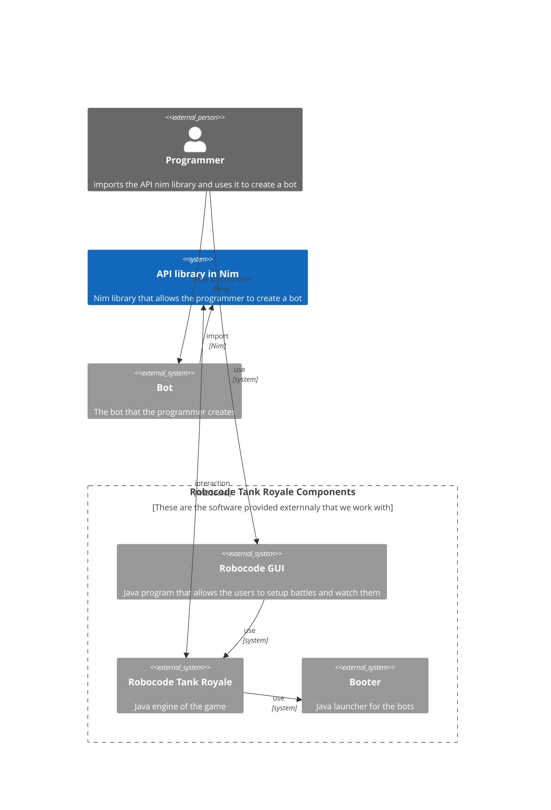

# README for the Robocode Tank Royale API written in Nim version 2

Nim 2.0 is out and brings a lot of iprovements to the language. This is a rewrite of the Robocode Tank Royale API written in Nim to take advantage of the new features of the language.

[Nim 2.0 Changes](https://nim-lang.org//blog/2023/08/01/nim-v20-released.html)

## Some diagrams to help understand the architecture of the API

### Contexts

### Bot interactions TODO (taken from [Schemas](https://github.com/robocode-dev/tank-royale/tree/master/schema/schemas#readme))
- [x] Joining a Server
    - [x] connect WebSocket
    - [x] receive [server-handshake](https://github.com/robocode-dev/tank-royale/blob/master/schema/schemas/server-handshake.yaml) from Server
    - [x] send [bot-handshake](https://github.com/robocode-dev/tank-royale/blob/master/schema/schemas/bot-handshake.yaml) to Server
- [x] Leaving a Server
    - [x] disconnect WebSocket
- [x] Partecipating in a Game
    - [x] receive [game-started-event-for-bot](https://github.com/robocode-dev/tank-royale/blob/master/schema/schemas/game-started-event-for-bot.yaml) from Server
    - [x] send [bot-ready](https://github.com/robocode-dev/tank-royale/blob/master/schema/schemas/bot-ready.yaml) to Server
- [x] Running turns of the game
    - [x] receive [round-started-event](https://github.com/robocode-dev/tank-royale/blob/master/schema/schemas/round-started-event.yaml) from Server
    - [x] receive [round-ended-event-for-bot](https://github.com/robocode-dev/tank-royale/blob/master/schema/schemas/round-ended-event-for-bot.yaml) from Server
    - [x] receive [tick-event-for-bot](https://github.com/robocode-dev/tank-royale/blob/master/schema/schemas/tick-event-for-bot.yaml) from Server
    - [x] receive [skipped-turn-event](https://github.com/robocode-dev/tank-royale/blob/master/schema/schemas/skipped-turn-event.yaml) from Server
    - [x] send [bot-intent](https://github.com/robocode-dev/tank-royale/blob/master/schema/schemas/bot-intent.yaml) to Server
- [x] end of the Game
    - [x] receive [game-ended-event-for-bot](https://github.com/robocode-dev/tank-royale/blob/master/schema/schemas/game-ended-event-for-bot.yaml)
    - [x] receive [won-round-event](https://github.com/robocode-dev/tank-royale/blob/master/schema/schemas/won-round-event.yaml)
- [x] in-game events
    - [x] receive [game-aborted-event](https://github.com/robocode-dev/tank-royale/blob/master/schema/schemas/game-aborted-event.yaml) from Server
    - [x] receive [bot-death-event](https://github.com/robocode-dev/tank-royale/blob/master/schema/schemas/bot-death-event.yaml) from Server when a bot dies
    - [x] receive [bot-hit-bot-event](https://github.com/robocode-dev/tank-royale/blob/master/schema/schemas/bot-hit-bot-event.yaml) from Server when our bot collides with another bot
    - [x] receive [bot-hit-wall-event](https://github.com/robocode-dev/tank-royale/blob/master/schema/schemas/bot-hit-wall-event.yaml) from Server when our bot collides with a wall
    - [x] receive [bullet-fired-event](https://github.com/robocode-dev/tank-royale/blob/master/schema/schemas/bullet-fired-event.yaml) from Server when our bot fires a bullet
    - [x] receive [bullet-hit-bot-event](https://github.com/robocode-dev/tank-royale/blob/master/schema/schemas/bullet-hit-bot-event.yaml) from Server when our bullet has hit a bot
    - [x] receive [bullet-hit-bullet-event](https://github.com/robocode-dev/tank-royale/blob/master/schema/schemas/bullet-hit-bullet-event.yaml) from Server when our bullet collided with another bullet
    - [x] receive [bullet-hit-wall-event](https://github.com/robocode-dev/tank-royale/blob/master/schema/schemas/bullet-hit-wall-event.yaml) from Server when our bullet has hit the wall
    - [x] receive [hit-by-bullet-event](https://github.com/robocode-dev/tank-royale/blob/master/schema/schemas/hit-by-bullet-event.yaml) from Server when our bot has been hit by a bullet
    - [x] receive [scanned-bot-event](https://github.com/robocode-dev/tank-royale/blob/master/schema/schemas/scanned-bot-event.yaml) from Server when our bot has scanned another bot
    - [x] receive [skipped-turn-event](https://github.com/robocode-dev/tank-royale/blob/master/schema/schemas/skipped-turn-event.yaml) from Server when our bot skipped a turn (the intent was not received at the server in time)
    - [x] receive [tick-event-for-bot](https://github.com/robocode-dev/tank-royale/blob/master/schema/schemas/tick-event-for-bot.yaml) from Server when a new turn is about to begin
    - [x] receive [won-round-event](https://github.com/robocode-dev/tank-royale/blob/master/schema/schemas/won-round-event.yaml) from Server

### IBaseBot methods to implement
- [ ] addCustomEvent​(Condition condition) _#Adds an event handler that will be automatically triggered onCustomEvent(dev.robocode.tankroyale.botapi.events.CustomEvent) when the Condition.test() returns true._
- [ ] bearingTo​(double x, double y) _#Calculates the bearing (delta angle) between the current direction of the bot's body and the direction to the point x,y._
- [ ] calcBearing​(double direction) _#Calculates the bearing (delta angle) between the input direction and the direction of this bot._
- [ ] calcBulletSpeed​(double firepower) _#Calculates the bullet speed given a fire power._
- [ ] calcDeltaAngle​(double targetAngle, double sourceAngle) _#Calculates the difference between two angles, i.e. the number of degrees from a source angle to a target angle._
- [ ] calcGunBearing​(double direction) _#Calculates the bearing (delta angle) between the input direction and the direction of the gun._
- [ ] calcGunHeat​(double firepower) _#Calculates gun heat after having fired the gun._
- [ ] calcMaxTurnRate​(double speed) _#Calculates the maximum turn rate for a specific speed._
- [ ] calcRadarBearing​(double direction) _#Calculates the bearing (delta angle) between the input direction and the direction of the radar._
- [ ] clearEvents() _#Clears the remaining events that have not been processed yet._
- [x] directionTo​(double x, double y) _#Calculates the direction (angle) from the bot´s coordinates to a point x,y._
- [ ] distanceTo​(double x, double y) _#Calculates the distance from the bot's coordinates to a point x,y._
- [x] getArenaHeight() _#Height of the arena measured in units._
- [x] getArenaWidth() _#Width of the arena measured in units._
- [x] getBodyColor() _#Returns the color of the body._
- [x] getBulletColor() _#Returns the color of the fired bullets._
- [ ] getBulletStates() _#Current bullet states._
- [x] getDirection() _#Current driving direction of the bot in degrees._
- [ ] getEnemyCount() _#Number of enemies left in the round._
- [x] getEnergy() _#Current energy level._
- [ ] getEventPriority​(java.lang.Class<BotEvent> eventClass) _#Returns the event priority for a specific event class._
- [ ] getEvents() _#Events that remain to be processed in event handlers, which is useful to see the events that remain from event handlers being called before other event handlers._
- [ ] getFirepower() _#Returns the firepower._
- [ ] getGameType() _#Game type, e.g._
- [x] getGunColor() _#Returns the color of the gun._
- [ ] getGunCoolingRate() _#Gun cooling rate._
- [x] getGunDirection() _#Current direction of the gun in degrees._
- [x] getGunHeat() _#Current gun heat._
- [x] getGunTurnRate() _#Returns the gun turn rate in degrees per turn._
- [x] getMaxGunTurnRate() _#Returns the maximum gun turn rate in degrees per turn._
- [ ] getMaxInactivityTurns() _#The maximum number of inactive turns allowed the bot will become zapped by the game for being inactive._
- [x] getMaxRadarTurnRate() _#Returns the maximum radar turn rate in degrees per turn._
- [x] getMaxSpeed() _#Returns the maximum speed in units per turn._
- [x] getMaxTurnRate() _#Returns the maximum turn rate of the bot in degrees per turn._
- [ ] getMyId() _#Unique id of this bot, which is available when the game has started._
- [ ] getNumberOfRounds() _#The number of rounds in a battle._
- [x] getRadarColor() _#Returns the color of the radar._
- [x] getRadarDirection() _#Current direction of the radar in degrees._
- [x] getRadarTurnRate() _#Returns the radar turn rate in degrees per turn._
- [x] getRoundNumber() _#Current round number._
- [x] getScanColor() _#Returns the color of the scan arc._
- [x] getSpeed() _#The current speed measured in units per turn._
- [x] getTargetSpeed() _#Returns the target speed in units per turn._
- [ ] getTimeLeft() _#The number of microseconds left of this turn before the bot will skip the turn._
- [x] getTracksColor() _#Returns the color of the tracks._
- [x] getTurnNumber() _#Current turn number._
- [x] getTurnRate() _#Returns the turn rate of the bot in degrees per turn._
- [ ] getTurnTimeout() _#The turn timeout is important as the bot needs to take action by calling go() before the turn timeout occurs._
- [x] getTurretColor() _#Returns the color of the gun turret._
- [ ] getVariant() _#The game variant, which is "Tank Royale"._
- [ ] getVersion() _#Game version, e.g. "1.0.0"._
- [x] getX() _#Current X coordinate of the center of the bot._
- [x] getY() _#Current Y coordinate of the center of the bot._
- [x] go() _#Commits the current commands (actions), which finalizes the current turn for the bot._
- [ ] gunBearingTo​(double x, double y) _#Calculates the bearing (delta angle) between the current direction of the bot's gun and the direction to the point x,y._
- [x] isAdjustGunForBodyTurn() _#Checks if the gun is set to adjust for the bot turning, i.e. to turn independent of the bot's body turn._
- [x] isAdjustRadarForBodyTurn() _#Checks if the radar is set to adjust for the body turning, i.e. to turn independent of the body's turn._
- [x] isAdjustRadarForGunTurn() _#Checks if the radar is set to adjust for the gun turning, i.e. to turn independent of the gun's turn._
- [ ] isDisabled() _#Specifies if the bot is disabled, i.e., when the energy is zero._
- [ ] isStopped() _#Checks if the movement has been stopped._
- [x] normalizeAbsoluteAngle​(double angle) _#Normalizes an angle to an absolute angle into the range [0,360[_
- [x] normalizeRelativeAngle​(double angle) _#Normalizes an angle to an relative angle into the range [-180,180[_
- [ ] onBotDeath​(BotDeathEvent botDeathEvent) _#The event handler triggered when another bot has died._
- [ ] onBulletFired​(BulletFiredEvent bulletFiredEvent) _#The event handler triggered when the bot has fired a bullet._
- [ ] onBulletHit​(BulletHitBotEvent bulletHitBotEvent) _#The event handler triggered when the bot has hit another bot with a bullet._
onBulletHitBullet​(BulletHitBulletEvent bulletHitBulletEvent) _#The event handler triggered when a bullet fired from the bot has collided with another bullet._
- [ ] onBulletHitWall​(BulletHitWallEvent bulletHitWallEvent) _#The event handler triggered when a bullet has hit a wall._
- [x] onConnected​(ConnectedEvent connectedEvent) _#The event handler triggered when connected to the server._
- [x] onConnectionError​(ConnectionErrorEvent connectionErrorEvent) _#The event handler triggered when a connection error occurs._
- [ ] onCustomEvent​(CustomEvent customEvent) _#The event handler triggered when some condition has been met._
- [x] onDeath​(DeathEvent deathEvent) _#The event handler triggered when this bot has died._
- [x] onDisconnected​(DisconnectedEvent disconnectedEvent) _#The event handler triggered when disconnected from the server._
- [x] onGameEnded​(GameEndedEvent gameEndedEvent) _#The event handler triggered when a game has ended._
- [x] onGameStarted​(GameStartedEvent gameStatedEvent) _#The event handler triggered when a game has started._
- [x] onHitBot​(HitBotEvent botHitBotEvent) _#The event handler triggered when the bot has collided with another bot._
- [x] onHitByBullet​(HitByBulletEvent hitByBulletEvent) _#The event handler triggered when the bot has been hit by a bullet._
- [x] onHitWall​(HitWallEvent botHitWallEvent) _#The event handler triggered when the bot has hit a wall._
- [x] onRoundEnded​(RoundEndedEvent roundEndedEvent) _#The event handler triggered when a round has ended._
- [x] onRoundStarted​(RoundStartedEvent roundStartedEvent) _#The event handler triggered when a new round has started._
- [x] onScannedBot​(ScannedBotEvent scannedBotEvent) _#The event handler triggered when the bot has skipped a turn._
- [x] onSkippedTurn​(SkippedTurnEvent skippedTurnEvent) _#The event handler triggered when the bot has skipped a turn._
- [x] onTick​(TickEvent tickEvent) _#The event handler triggered when a game tick event occurs, ie., when a new turn in a round has started._
- [x] onWonRound​(WonRoundEvent wonRoundEvent) _#The event handler triggered when the bot has won a round._
- [ ] radarBearingTo​(double x, double y) _#Calculates the bearing (delta angle) between the current direction of the bot's radar and the direction to the point x,y._
- [ ] removeCustomEvent​(Condition condition) _#Removes triggering a custom event handler for a specific condition that was previously added with addCustomEvent(dev.robocode.tankroyale.botapi.events.Condition)._
- [x] setAdjustGunForBodyTurn​(boolean adjust) _#Sets the gun to adjust for the bot's turn when setting the gun turn rate._
- [x] setAdjustRadarForBodyTurn​(boolean adjust) _#Sets the radar to adjust for the body's turn when setting the radar turn rate._
- [x] setAdjustRadarForGunTurn​(boolean adjust) _#Sets the radar to adjust for the gun's turn when setting the radar turn rate._
- [x] setBodyColor​(Color color) _#Sets the color of the body._
- [x] setBulletColor​(Color color) _#Sets the color of the fired bullets._
- [ ] setEventPriority​(java.lang.Class<BotEvent> eventClass, int priority) _#Changes the event priority for an event class._
- [x] setFire​(double firepower) _#Sets the gun to fire in the direction that the gun is pointing with the specified firepower._
- [ ] setFireAssist​(boolean enable) _#Enables or disables fire assistance explicitly._
- [x] setGunColor​(Color color) _#Sets the color of the gun._
- [x] setGunTurnRate​(double gunTurnRate) _#Sets the turn rate of the gun, which can be positive and negative._
- [ ] setInterruptible​(boolean interruptible) _#Call this method during an event handler to control continuing or restarting the event handler, when a new event occurs again for the same event handler while processing an earlier event._
- [ ] setMaxGunTurnRate​(double maxGunTurnRate) _#Sets the maximum turn rate which applies to turn the gun to the left or right._
- [ ] setMaxRadarTurnRate​(double maxRadarTurnRate) _#Sets the maximum turn rate which applies to turn the radar to the left or right._
- [ ] setMaxSpeed​(double maxSpeed) _#Sets the maximum speed which applies when moving forward and backward._
- [ ] setMaxTurnRate​(double maxTurnRate) _#Sets the maximum turn rate which applies to turn the bot to the left or right._
- [x] setRadarColor​(Color color) _#Sets the color of the radar._
- [x] setRadarTurnRate​(double gunRadarTurnRate) _#Sets the turn rate of the radar, which can be positive and negative._
- [x] setRescan() _#Sets the bot to rescan with the radar._
- [ ] setResume() _#Sets the bot to scan (again) with the radar._
- [x] setScanColor​(Color color) _#Sets the color of the scan arc._
- [x] setStop() _#Set the bot to stop all movement including turning the gun and radar._
- [x] setTargetSpeed​(double targetSpeed) _#Sets the new target speed for the bot in units per turn._
- [x] setTracksColor​(Color color) _#Sets the color of the tracks._
- [x] setTurnRate​(double turnRate) _#Sets the turn rate of the bot, which can be positive and negative._
- [x] setTurretColor​(Color color) _#Sets the color of the gun turret._
- [x] start() _#The method used to start running the bot._

### IBot methods to implement
- [x] back​(double distance) _#Moves the bot backward until it has traveled a specific distance from its current position, or it is moving into an obstacle._
- [x] fire​(double firepower) _#Fire the gun in the direction as the gun is pointing._
- [x] forward​(double distance) _#Moves the bot forward until it has traveled a specific distance from its current position, or it is moving into an obstacle._
- [x] getDistanceRemaining() _#Returns the distance remaining till the bot has finished moving after having called IBot.setForward(double), IBot.setBack(double), IBot.forward(double), or IBot.back(double)._
- [X] getGunTurnRemaining() _#Returns the remaining turn in degrees till the gun has finished turning after having called IBot.setTurnGunLeft(double), IBot.setTurnGunRight(double), IBot.turnGunLeft(double), or IBot.turnGunRight(double)._
- [X] getRadarTurnRemaining() _#Returns the remaining turn in degrees till the radar has finished turning after having called IBot.setTurnRadarLeft(double), IBot.setTurnRadarRight(double), IBot.turnRadarLeft(double), or IBot.turnRadarRight(double)._
- [X] getTurnRemaining() _#Returns the remaining turn in degrees till the bot has finished turning after having called IBot.setTurnLeft(double), IBot.setTurnRight(double), IBot.turnLeft(double), or IBot.turnRight(double)._
- [x] isRunning() _#Checks if this bot is running._
- [x] rescan() 	_#Scan (again) with the radar._
- [ ] resume() 	_#Resume the movement prior to calling the IBaseBot.setStop() or IBot.stop() method._
- [x] setBack​(double distance) _#Set the bot to move backward until it has traveled a specific distance from its current position, or it is moving into an obstacle._
- [x] setForward​(double distance) _#Set the bot to move forward until it has traveled a specific distance from its current position, or it is moving into an obstacle._
- [x] setGunTurnRate​(double turnRate) _#Sets the turn rate of the gun, which can be positive and negative._
- [x] setRadarTurnRate​(double turnRate) _#Sets the turn rate of the radar, which can be positive and negative._
- [x] setTargetSpeed​(double targetSpeed) _#Sets the new target speed for the bot in units per turn._
- [x] setTurnGunLeft​(double degrees) _#Set the gun to turn to the left (following the increasing degrees of the unit circle) until it turned the specified amount of degrees._
- [x] setTurnGunRight​(double degrees) _#Set the gun to turn to the right (following the decreasing degrees of the unit circle) until it turned the specified amount of degrees._
- [x] setTurnLeft​(double degrees)	_#Set the bot to turn to the left (following the increasing degrees of the unit circle) until it turned the specified amount of degrees._
- [x] setTurnRadarLeft​(double degrees) _#Set the radar to turn to the left (following the increasing degrees of the unit circle) until it turned the specified amount of degrees._
- [x] setTurnRadarRight​(double degrees) _#Set the radar to turn to the right (following the decreasing degrees of the unit circle) until it turned the specified amount of degrees._
- [x] setTurnRate​(double turnRate) _#Sets the turn rate of the bot, which can be positive and negative._
- [x] setTurnRight​(double degrees) _#Set the bot to turn to the right (following the decreasing degrees of the unit circle) until it turned the specified amount of degrees._
- [ ] stop() _#Stop all movement including turning the gun and radar._
- [x] turnGunLeft​(double degrees) _#Turn the gun to the left (following the increasing degrees of the unit circle) until it turned the specified amount of degrees._
- [x] turnGunRight​(double degrees) _#Turn the gun to the right (following the decreasing degrees of the unit circle) until it turned the specified amount of degrees._
- [x] turnLeft​(double degrees) _#Turn the bot to the left (following the increasing degrees of the unit circle) until it turned the specified amount of degrees._
- [x] turnRadarLeft​(double degrees) _#Turn the radar to the left (following the increasing degrees of the unit circle) until it turned the specified amount of degrees._
- [x] turnRadarRight​(double degrees) _#Turn the radar to the right (following the increasing degrees of the unit circle) until it turned the specified amount of degrees._
- [x] turnRight​(double degrees) _#Turn the bot to the right (following the increasing degrees of the unit circle) until it turned the specified amount of degrees._
waitFor​(Condition condition) _#Blocks until a condition is met, i.e. when a Condition.test() returns true._

### planned TODO
- [x] ~~init a new Bot importing the library~~ crete a new bot inheriting from a Bot object
- [x] init the bot passing a standard json file (read [create a json file for bot info](https://robocode-dev.github.io/tank-royale/tutorial/my-first-bot.html#create-a-json-file-for-bot-info))
- [x] have a "run" method
- [x] open WebSocket to Server to start the connection handshake
- [x] find out how to call a method that can be overridden from a new bot
- [x] find elegant method to convert between json and Messages object
- [x] implement all Messages objects
- [x] connect to server completing the handshake
- [ ] implement all [IBaseBot](https://robocode-dev.github.io/tank-royale/api/java/dev/robocode/tankroyale/botapi/IBaseBot.html) methods
- [ ] implement all [IBot](https://robocode-dev.github.io/tank-royale/api/java/dev/robocode/tankroyale/botapi/IBot.html) methods
- [x] write bash launcher (maybe with input functionality)
- [ ] complete standard bot bits and bobs necessary to make a working version 1.0.0
