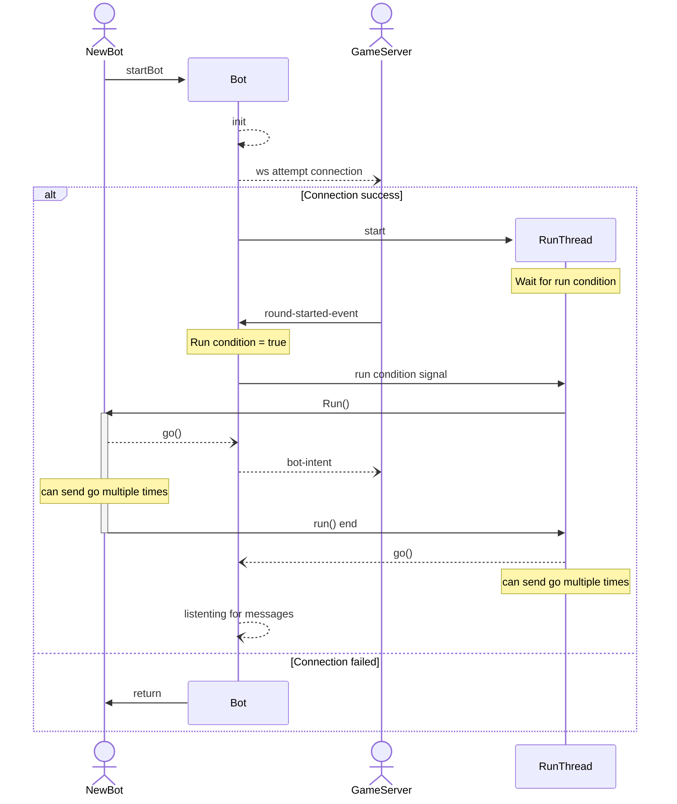

```mermaid
sequenceDiagram
    actor NewBot

    create participant Bot
    NewBot->>Bot: startBot

    actor GameServer
    Bot-->>Bot: init
    Bot--)GameServer: ws attempt connection
    alt Connection success
        create participant RunThread
        Bot->>RunThread: start
        Note over RunThread: Wait for run condition

        GameServer->>Bot: round-started-event
        Note over Bot: Run condition = true
        Bot->>RunThread: run condition signal

        RunThread->>NewBot: Run()
        activate NewBot
        NewBot--)Bot: go()
        Bot--)GameServer: bot-intent
        Note over NewBot: can send go multiple times
        NewBot->>RunThread: run() end
        deactivate NewBot
        RunThread--)Bot: go()
        Note over RunThread: can send go multiple times

        Bot--)Bot: listenting for messages 
    else Connection failed
        destroy Bot
        Bot->>NewBot: return
    end    
```