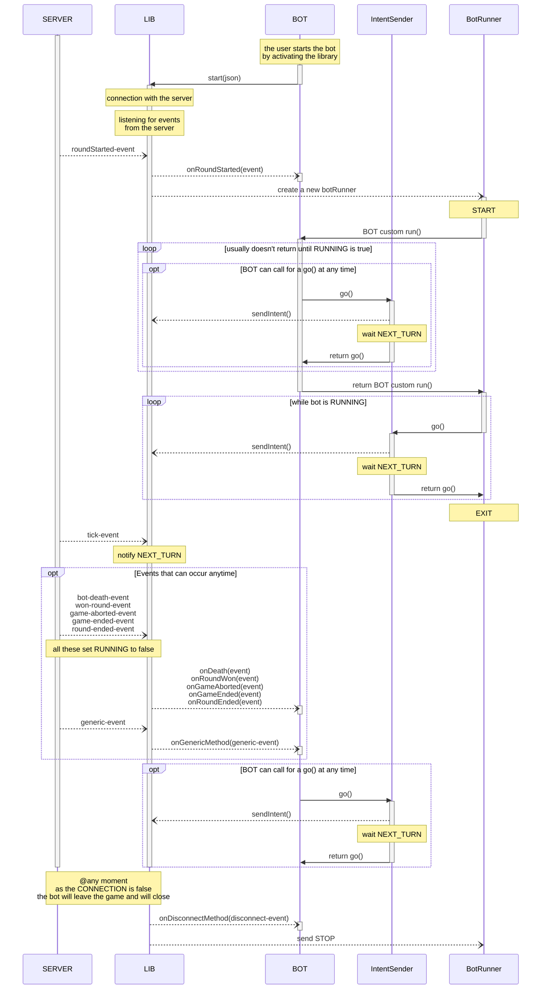

# interaction between threads
This should describe what I think should be (or help me find out) the best way to implement the Bot Library interaction with the user code and the game server.

```mermaid
sequenceDiagram
    participant SERVER
    participant LIB
    participant BOT
    participant IntentSender
    participant BotRunner

    activate SERVER
    Note over BOT: the user starts the bot <br> by activating the library
    activate BOT

    BOT->>LIB: start(json)
    deactivate BOT

    activate LIB
    Note over LIB: connection with the server
    Note over LIB: listening for events <br> from the server

    SERVER--)LIB: roundStarted-event

    LIB--)BOT: onRoundStarted(event)
    activate BOT
    deactivate BOT

    LIB--)BotRunner: create a new botRunner

    activate BotRunner
    Note over BotRunner: START
    BotRunner->>BOT: BOT custom run()
    deactivate BotRunner
    activate BOT

    loop usually doesn't return until RUNNING is true
        opt BOT can call for a go() at any time
            BOT->>IntentSender: go()
            activate IntentSender
            IntentSender--)LIB: sendIntent()
            Note over IntentSender: wait NEXT_TURN
            IntentSender->>BOT: return go()
            deactivate IntentSender
        end
    end

    BOT->>BotRunner: return BOT custom run()
    deactivate BOT
    activate BotRunner

    loop while bot is RUNNING
        BotRunner->>IntentSender: go()
        deactivate BotRunner
        activate IntentSender
        IntentSender--)LIB: sendIntent()
        Note over IntentSender: wait NEXT_TURN
        IntentSender->>BotRunner: return go()
        deactivate IntentSender
    end

    Note over BotRunner: EXIT

    SERVER--)LIB: tick-event
    Note over LIB: notify NEXT_TURN

    opt Events that can occur anytime
        SERVER--)LIB: bot-death-event <br> won-round-event <br> game-aborted-event <br> game-ended-event <br> round-ended-event
        Note over SERVER,LIB: all these set RUNNING to false
        LIB--)BOT: onDeath(event) <br> onRoundWon(event) <br> onGameAborted(event) <br> onGameEnded(event) <br> onRoundEnded(event)
        activate BOT
        deactivate BOT

        SERVER--)LIB: generic-event
        LIB--)BOT: onGenericMethod(generic-event)
        activate BOT
        deactivate BOT
    end

    opt BOT can call for a go() at any time
        BOT->>IntentSender: go()
        activate IntentSender
        IntentSender--)LIB: sendIntent()
        Note over IntentSender: wait NEXT_TURN
        IntentSender->>BOT: return go()
        deactivate IntentSender
    end

    deactivate LIB
    deactivate SERVER

    Note over SERVER,LIB: @any moment<br>as the CONNECTION is false<br>the bot will leave the game and will close
    LIB--)BOT: onDisconnectMethod(disconnect-event)
    activate BOT
    deactivate BOT
    LIB--)BotRunner: send STOP
```
